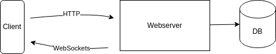

> Als Abgabe erfolgt ein 3-Seiten-Bericht über das Projekt. Darin enthalten sind:
    • Motivation und Projektidee: Orientiert euch dabei an eurem Einseiter zu Beginn des Semesters und schaut, ob sich eure Idee seitdem weiterentwickelt hat.
    • Projektstruktur: verwendete Hardware, Software, Plugins, weitere im Netz geborgte Codeschnipsel etc. Hier wäre ergänzend ein Diagramm über die Projektstruktur sinnvoll (ich empfehle draw.io für die Erstellung)
    • Angaben zur Projektaufteilung: Wer hat was gemacht? Wieso war dies eine faire Arbeitsaufteilung? Nennt hierbei auch mögliche Expertise in dem Arbeitsbereich, der dazu geführt hat, dass ihr die Gruppenaufteilung so gewählt habt.
    • Pflichtkriterien: Falls bei den vorherigen Punkten noch nicht erwähnt, wie habt ihr die Pflichtkriterien erfüllt.

# Dokumentation - Findz

> Sollen wir die Doku direkt auf Englisch machen? Dann kann man das github Repo direkt als Portfolio Projekt nutzen!

- [Dokumentation - Findz](#dokumentation---findz)
  - [Projektidee \& Motivation](#projektidee--motivation)
  - [Projektstruktur](#projektstruktur)
    - [Hardware](#hardware)
    - [Software](#software)
    - [Architecture](#architecture)
    - [Interface](#interface)
  - [Projektaufteilung](#projektaufteilung)
  - [Pflichtkriterien](#pflichtkriterien)
  - [Was haben wir gelernt?](#was-haben-wir-gelernt)

## Projektidee & Motivation

Spotlight yourself so your friends find you easily. Dont lose your friend in a crowd. ...(Beispiel)
Mark points of interest.

## Projektstruktur

### Hardware

- Client: Android compatible mobile phones
- Server: Tobis Notebook

### Software

- Clientside: Angular.js
- Serverside: Flask (Python framework)
- Database:   sqlite3
- AR:         WebXR / ARCore
- Deployment: Docker
- Host exposure: Cloudflare Tunnel
- Authentication: Google     

### Architecture

### Interface

## Projektaufteilung

- Wiete: Clientside/Frontend programming & UX design
- Tobi: Product Owner & WebXR programming
- Thomas: Serverside/Backend programming

Begründung für die Aufteilung:

## Pflichtkriterien

## Was haben wir gelernt?